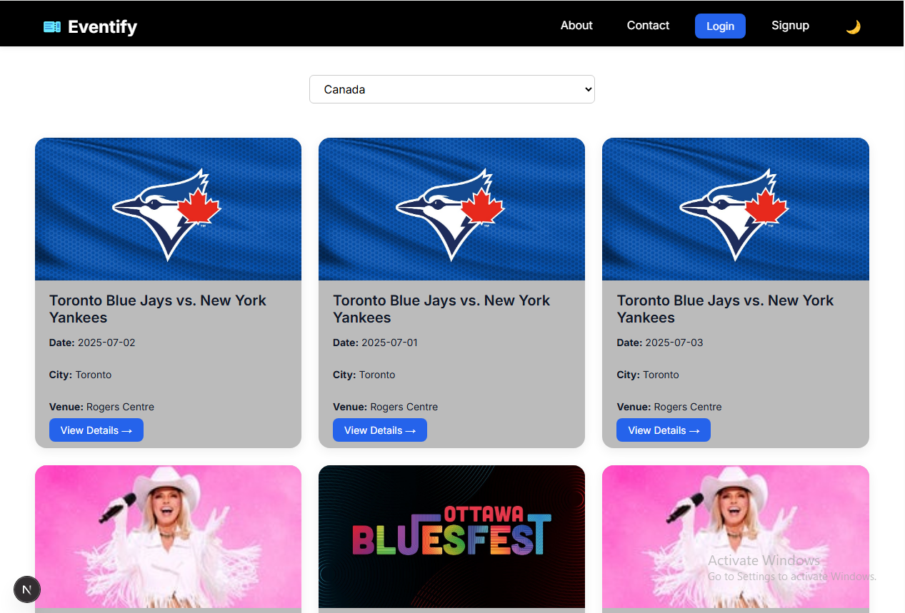
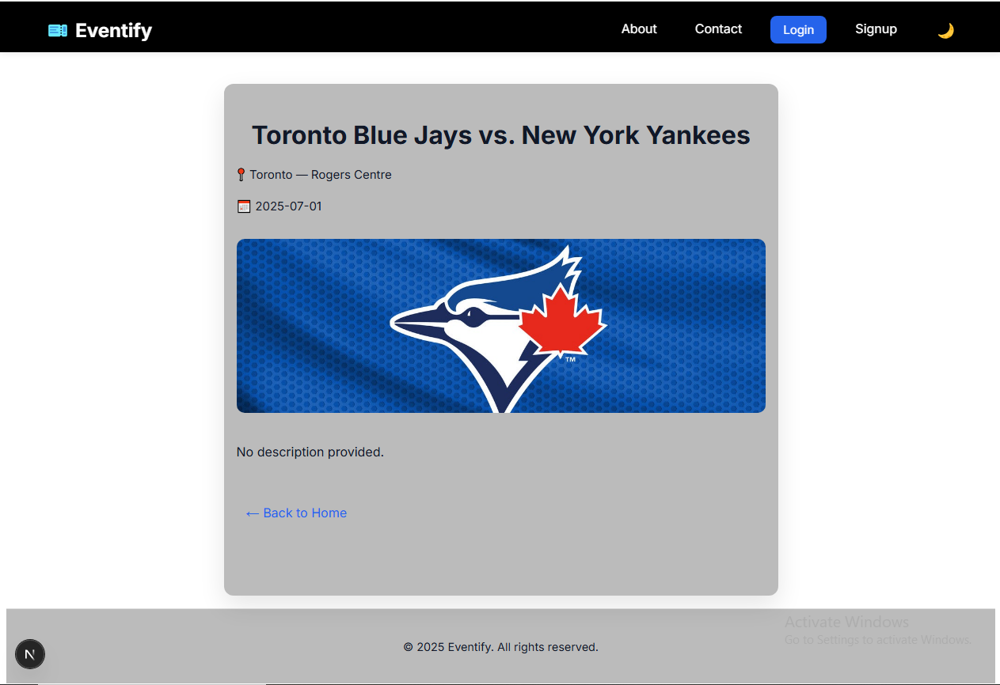
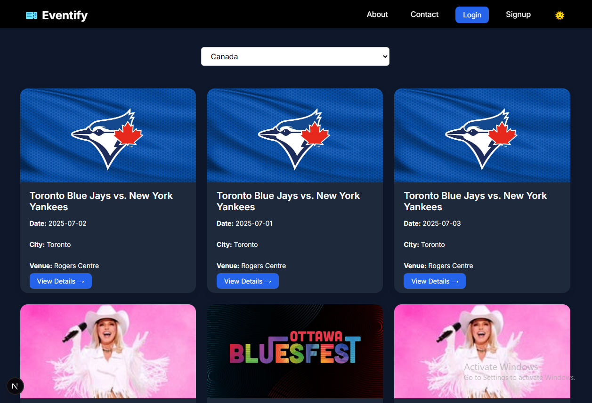

# 🎫 Eventify — Discover Events, Effortlessly

Eventify is a modern, responsive web app built with **Next.js** that lets users explore events across countries with ease. Features include authentication, filters, detail pages, responsive layout, and dark mode toggle.

🌐 **Live Demo:** [eventify-indol-five.vercel.app](https://eventify-indol-five.vercel.app/)

---

## 🚀 Features

- 🌍 Country-based event filtering
- 🔐 User login & signup (localStorage-based)
- 📱 Fully responsive design
- 🌙 Dark/Light mode toggle
- 🧭 Active navigation highlighting
- 🎨 Clean, modern Tailwind UI (utility‑first, themable)
- 🛠 Built using **Next.js App Router**

---

## 🖼️ Screenshots

| Home Page | Detail Page | Dark Mode |
|-----------|-------------|-----------|
|  |  |  |

---

## 🧑‍💻 Tech Stack

- **Framework:** [Next.js 14+](https://nextjs.org/)
- **Styling:** Tailwind CSS (utility-first) + Dark Mode (`dark` class strategy)
- **Routing:** App Router (`app/` directory)
- **State:** `useState`, `useEffect`, `localStorage`
- **Deployment:** [Vercel](https://vercel.com)

---

## ⚙️ Getting Started

### 1. Clone the repo
```bash
git clone https://github.com/jehanzaib-dev/Eventify.git
cd eventify
2. Install dependencies
bash
Copy code
npm install
3. Run locally
bash
Copy code
npm run dev
4. Open in browser
arduino
Copy code
http://localhost:3000
📁 Folder Structure
text
Copy code
eventify/
├── app/
│   ├── layout.js
│   ├── page.js
│   ├── login/
│   ├── signup/
│   ├── homepage/
│   ├── events/
│       └── [id]/
│           ├── page.jsx
│           ├── loading.js
├── components/
│   ├── Navbar.jsx
│   ├── Footer.jsx
│   ├── EventCard.jsx
│   ├── Loading.jsx
│   ├── Spinner.jsx
│   └── shared/
│       ├── ErrorPage.jsx
│       └── NotFoundPage.jsx
├── utils/
│   ├── fetchEvents.js
│   ├── fetchEventDetails.js
│   └── mockUsers.js
├── public/
│   └── (images, favicon, screenshots)
├── styles/
│   └── globals.css   # Tailwind directives only
├── tailwind.config.js
├── postcss.config.js
└── next.config.js
🛠 Tailwind Setup Notes (Summary)
Dark Mode: Configured via darkMode: 'class' in tailwind.config.js.

Content paths: Point to app/, components/, and utils (if using classNames there).

Global CSS: Only @tailwind base; @tailwind components; @tailwind utilities; plus minimal structural rules.

Theming: Light mode gets subtle gray background (bg-gray-50), components use bg-white shadow-sm; dark mode uses neutral slate/dark grays.

👨‍🎨 Author
Built by Raja Jehanzaib Arshad

GitHub: @jehanzaib-dev

📄 License
This project is licensed under the MIT License — feel free to use, fork, or contribute.

🙌 Acknowledgements
Next.js Docs

CSS Tricks